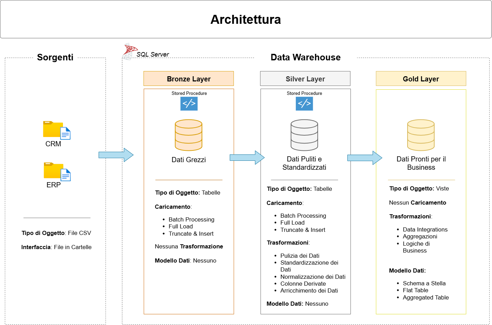

# Progetto Data Warehouse

Repository contenente un progetto **end-to-end** di **Data Warehousing** con implementazione completa di pipeline ETL, modellazione dati e layer analitici utilizzando **SQL Server**.

-----

## Panoramica del Progetto

Questo progetto dimostra la costruzione completa di un **Data Warehouse moderno** per l'analisi delle vendite retail, integrando dati provenienti da sistemi aziendali eterogenei (**ERP** e **CRM**).

### Obiettivi Chiave

Il progetto si propone di:

  - **Consolidare** dati provenienti da fonti diverse in un unico repository analitico.
  - **Implementare** un'architettura scalabile e manutenibile basata sul pattern **Medallion Architecture**.
  - **Garantire** la qualità dei dati attraverso processi di validazione e pulizia (**Data Quality**).
  - **Fornire** un modello dimensionale (**Star Schema**) ottimizzato per query analitiche.
  - **Automatizzare** i processi ETL tramite **Stored Procedures** riutilizzabili.

### Competenze Dimostrate

Questo progetto evidenzia competenze pratiche e teoriche in:

  - **SQL Avanzato (T-SQL)**: Query complesse, *Window Functions*, *Stored Procedures*.
  - **Data Engineering**: Progettazione e implementazione di pipeline **ETL**.
  - **Data Modeling**: **Star Schema**, **Dimension Tables** e **Fact Tables**.
  - **Data Quality**: Processi di pulizia, validazione e standardizzazione.
  - **Data Architecture**: Implementazione della **Medallion Architecture** (Bronze-Silver-Gold).
  - **Documentazione Tecnica**: Diagrammi architetturali e catalogo dati.

-----

## Architettura dei Dati

L'architettura dei dati per questo progetto adotta la **Medallion Architecture**, che organizza i dati in tre **Layer** progressivi: Bronze, Silver e Gold.




* **Bronze Layer**: Contiene i dati grezzi (*Raw Data*) dai sistemi sorgente. I dati vengono ingeriti dai **File CSV** nel database **SQL Server**.
* **Silver Layer**: Questo Layer include i processi di pulizia, standardizzazione e normalizzazione per preparare i dati all'analisi. 
* **Gold Layer**: Ospita i dati **pronti per il business**, modellati in uno **Star Schema** e ottimizzati per la reportistica e l'analisi. 

-----

## Struttura del Repository

```
data-warehouse-project/
│
├── datasets/                           # Dati sorgente grezzi utilizzati nel progetto (dati ERP e CRM).
├── docs/                               # Documentazione di progetto e dettagli architetturali.
│   ├── data_architecture.png           # Diagramma che illustra l'architettura complessiva del progetto (Medallion).
│   ├── data_catalog.md                 # Catalogo dati completo con descrizioni dei campi e metadati.
│   ├── data_flow.png                   # Diagramma che illustra il flusso logico dei dati tra i Layer.
│   └── data_models.png                 # Diagramma che illustra i modelli dati finali (Star Schema).
│
├── scripts/                            # Script SQL per l'implementazione ETL e le trasformazioni.
│   ├── init_database.sql               # Creazione database e schemi.
│   ├── bronze/                         # Script per l'estrazione e il caricamento dei dati grezzi nel Layer Bronze.
│   ├── silver/                         # Script per la pulizia, la standardizzazione e la trasformazione dei dati nel Layer Silver.
│   └── gold/                           # Script per la creazione e il popolamento dei modelli analitici finali nel Layer Gold.
│
├── tests/                              # Script SQL per i test di Data Quality e le validazioni tra i Layer.
│
└── README.md                           # Panoramica del progetto e istruzioni dettagliate (il documento principale).
 
```

-----

## Tecnologie Utilizzate

| Componente | Tecnologia | Utilizzo |
| :--- | :--- | :--- |
| **Database** | **SQL Server Express** | Hosting del Data Warehouse e esecuzione logiche ETL. |
| **IDE** | **SQL Server Management Studio (SSMS)** | Sviluppo, debugging e gestione del database. |
| **Linguaggio** | **T-SQL** | Implementazione di Query, Stored Procedures e logiche ETL. |
| **Versionamento** | **Git / GitHub** | Controllo delle versioni del codice e collaborazione. |
| **Diagrammi** | **Draw.io** | Documentazione architetturale e modellazione dati. |
| **Formato Dati** | **CSV** | Formato per i dati sorgente. |

-----

## Guida all'Installazione e Setup

### **Prerequisiti:**

1.  Installare **SQL Server Express** o edizione superiore.
2.  Installare **SQL Server Management Studio (SSMS)**.
3.  Clonare questa repository:
    ```bash
    git clone https://github.com/AntoninoMaenza/Progetto-Data-Warehouse.git
    ```
4.  Caricare i dataset di esempio contenuti nella cartella `/datasets/` in una directory accessibile da SQL Server.

### **Esecuzione degli Script SQL:**

L'inizializzazione e il popolamento del Data Warehouse devono seguire un ordine sequenziale per garantire la corretta dipendenza dei **Layer**:

1.  **Inizializzazione Database:** Eseguire `scripts/init_database.sql`.
2.  **Esecuzione Pipeline ETL:** Eseguire gli script nelle seguenti cartelle, nell'ordine indicato:
      * `scripts/bronze/` $\rightarrow$ Caricamento dei dati grezzi.
      * `scripts/silver/` $\rightarrow$ Pulizia e trasformazione dei dati.
      * `scripts/gold/` $\rightarrow$ Popolamento del modello analitico finale.
3.  **Controlli di Qualità:** Eseguire gli script in `/tests/` per validare l'integrità del modello dati.
